## Enlace de Trello

## Home de fauna
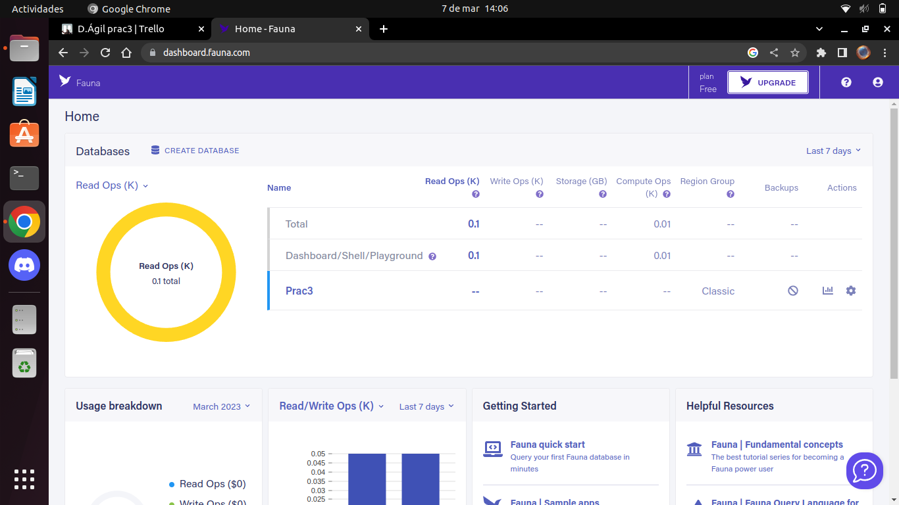

## Basese datos de fauna
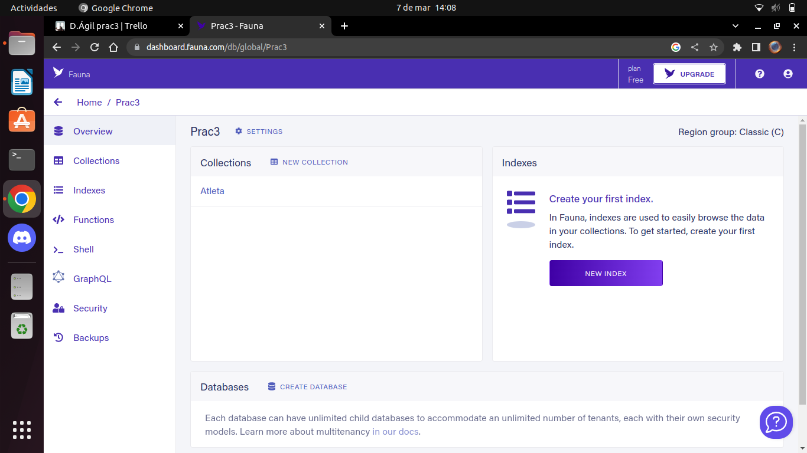

## Coleccion de fauna
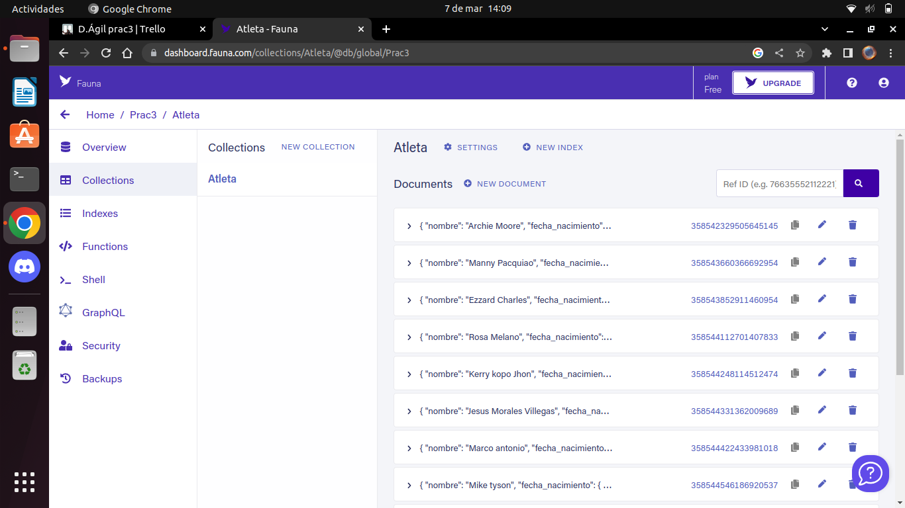

## Incremento 1
### HU 1 - Ver informacion autor al pulsar 'acerca de'
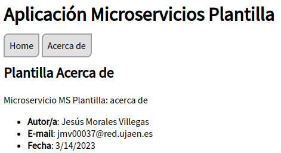

### HU 2 - Ver un listado solo con los nombres de todos los jugadores
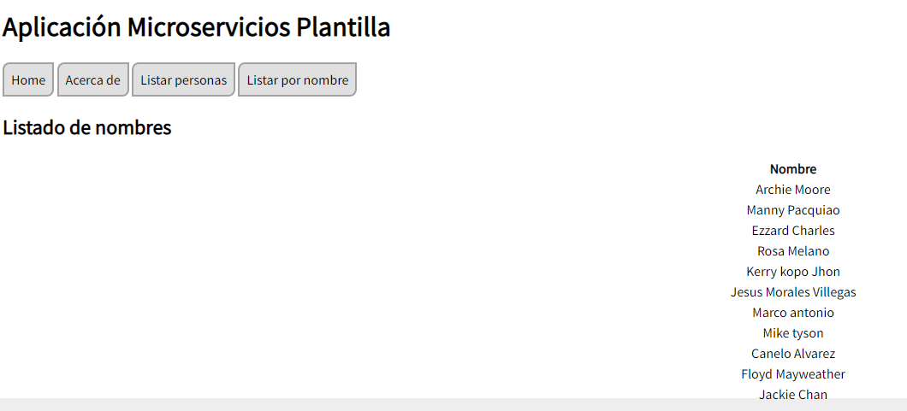

### HU 4 - Ver un listado con todos los datos de todos los jugadores
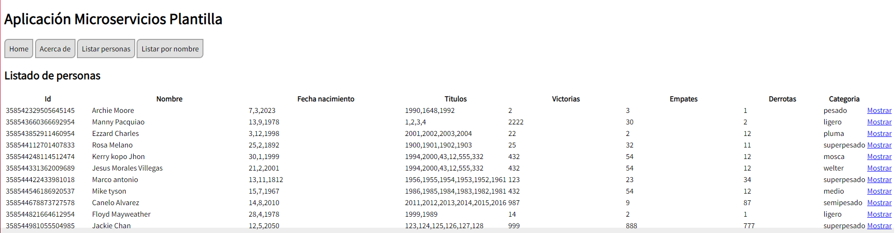

## Incremento 2
### HU 3 - Ver un listado solo con los nombres de todos los jugadores/equipos ordenados alfabéticamente.
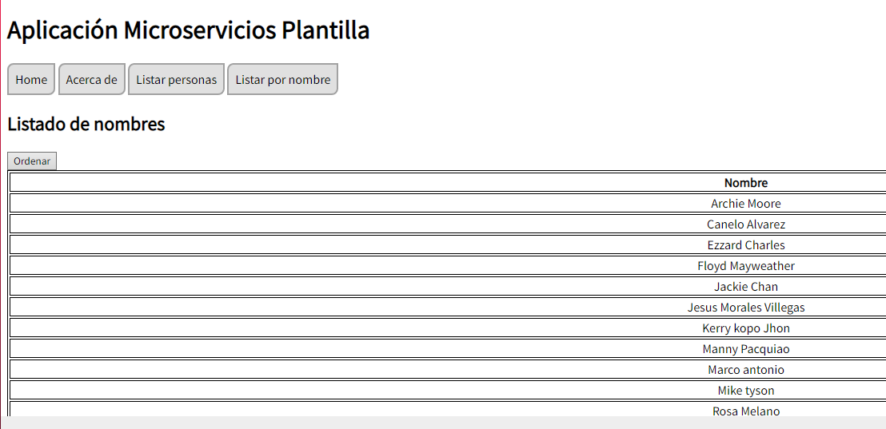

### HU 5 - Ver un listado con todos los datos de todos los jugadores/equipos ordenado por el campo del jugador/equipo que el usuario desee
Para ordenar hay que pulsar en la cabecera de la tabla en el campo por el cual queremos ordenar
+ Ordenado por el campo ID
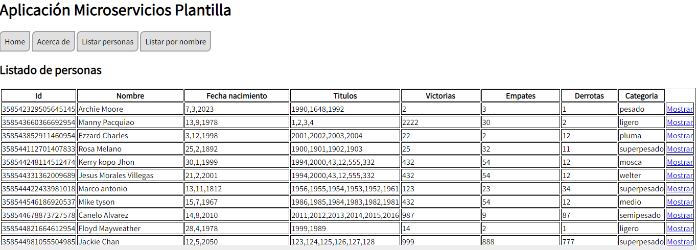

+ Ordenado por el campo Nombre
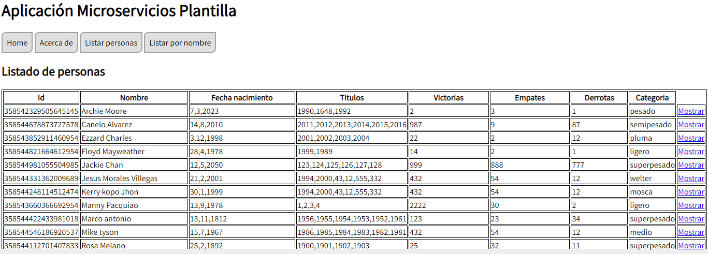

+ Ordenado por el campo Fecha
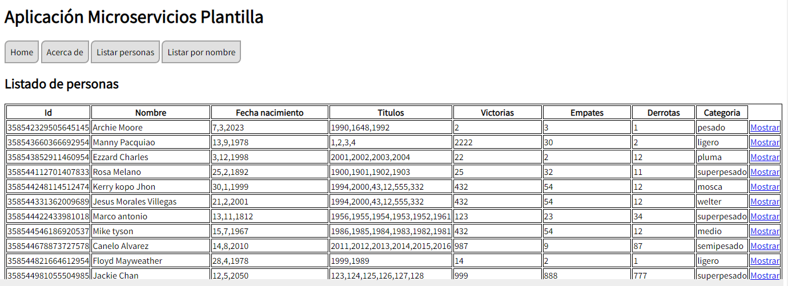

+ Ordenado por el campo Títulos
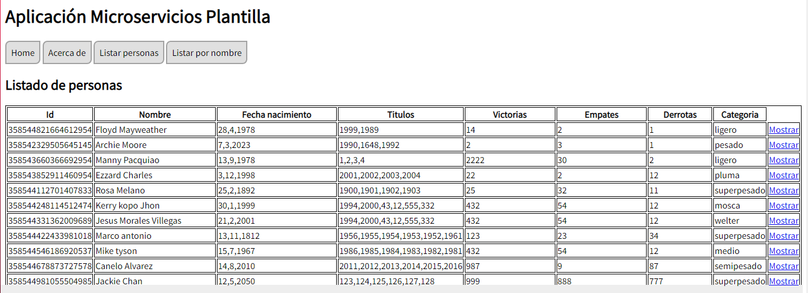

+ Ordenado por el campo Victorias
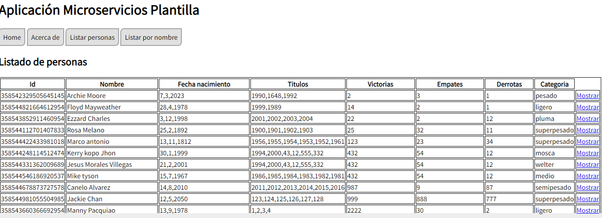

+ Ordenado por el campo Empates
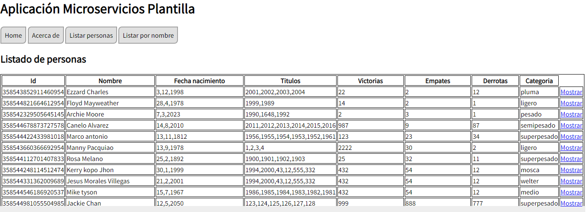

+ Ordenado por el campo Derrotas
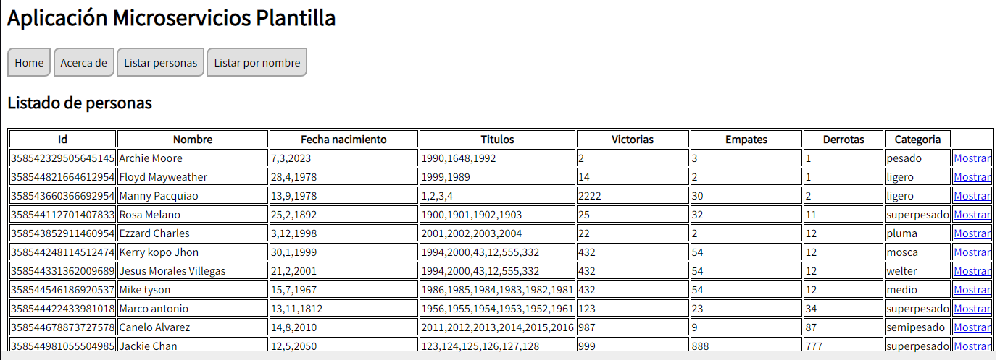

+ Ordenado por el campo Categoría
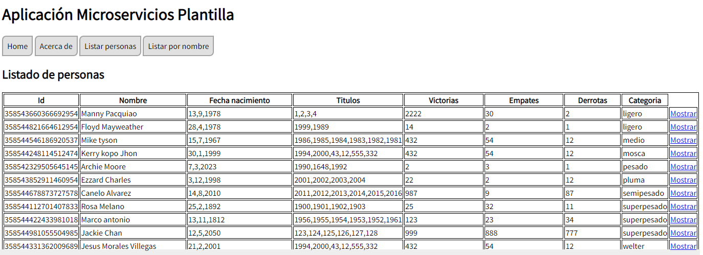

### HU 6 - Ver todos los datos de un determinado jugador
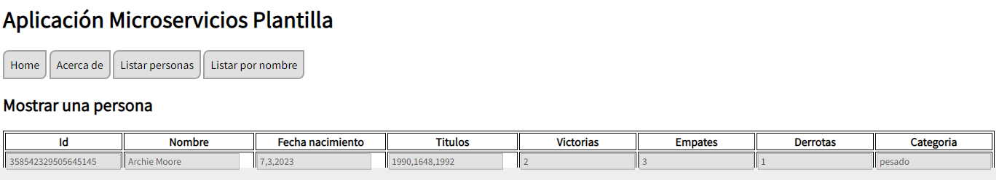

## Incremento 3
### HU 7 - Ver los datos de un determinado jugador/equipo, cambiando con un solo click para ver los datos del anterior o del siguiente.
En los enlaces debajo de la tabla se puede pasar al siguiente o al anterior.
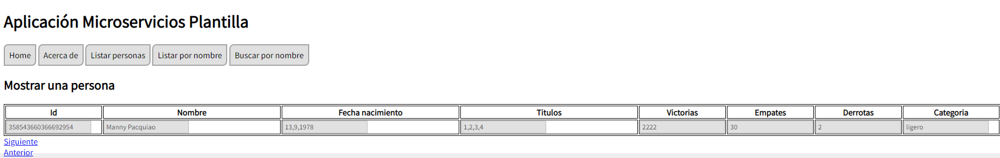

### HU 8 - Ver un listado de todos los datos de jugadores/equipos cuyo nombre cumple con un criterio de búsqueda indicado por el usuario.
Si le damos al boton buscar por nombre aparece un buscador
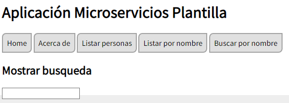
Si en el buscador escribimos por ejemplo "p" aparecen todos los que en su nombre tiene una p
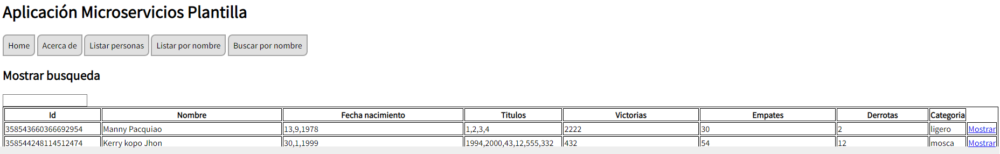
En este caso solo aparecen dos personas que contienen el criterio de busqueda mencionado anteriormente.